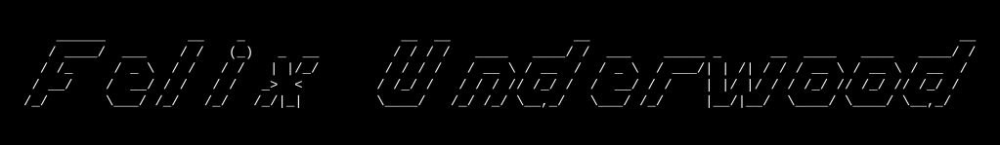

<!--
**Fel1x22/Fel1x22** is a ✨ _special_ ✨ repository because its `README.md` (this file) appears on your GitHub profile.

Here are some ideas to get you started:

- 🔭 I’m currently working on ...
- 🌱 I’m currently learning ...
- 👯 I’m looking to collaborate on ...
- 🤔 I’m looking for help with ...
- 💬 Ask me about ...
- 📫 How to reach me: ...
- 😄 Pronouns: ...
- ⚡ Fun fact: ...
-->

    

### Junior Software Engineer | Computer Science Graduate
#### Seeking a full-stack, graduate software engineering position.

## About Me
I am a junior software engineer with hands-on full-stack experience from my internship with Imago Software, utilising ReactJS and FastAPI to build software for Cancer Research UK. I'm passionate about writing efficient, maintainable code and working in fast-paced agile environments, seeking to continue learning in a junior full-stack role. In my spare time I enjoy running, going to concerts and movie nights with my cat.

## Education
### The University of Manchester 

BSc Computer Science - First Class

### The Skinners School
A-Levels in Maths, Further Maths, Economics, Computer Science - A* A* A* A

## Find Me Here!

  
  
  
  

